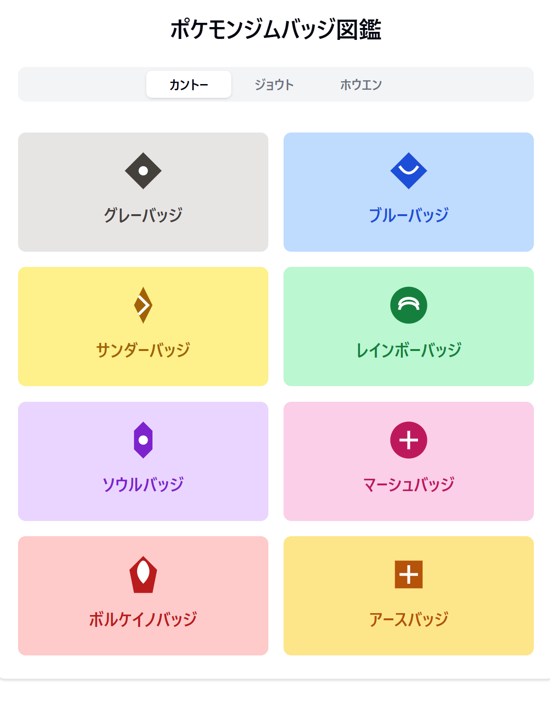
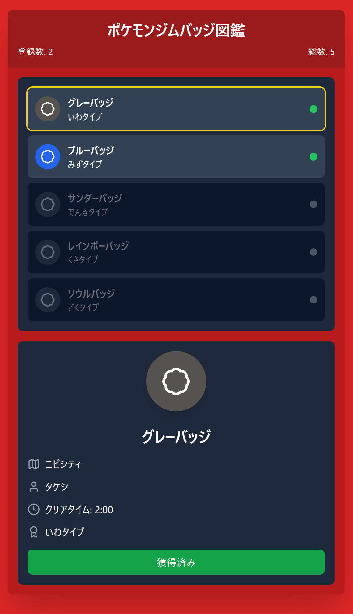

## 本日の開発
- 「ジムリーダーになろう」の開発中
  - サンプルのジムバッジ一覧画面を何パターンか作成  
    - 案2、とてもよいな

## 本日の日記
- 夕方から朝にかけてのデータ更新作業(計画作業)が夜12時に終わりました。
- 昼も働いていたんだけどね…！
- 今日をポッキープリッツの日という風に習慣づけていった人はすごいな

## 本日のBGM
- 機動戦士ガンダム38話

バッジ図鑑の案画像1  
  
バッジ図鑑の案画像2  
  
